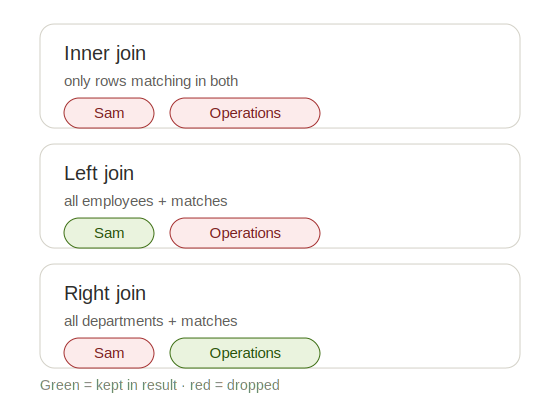

# JOINs (INNER, LEFT, RIGHT, FULL)

**Topic:** _Combining tables_ · **Date:** _2026-07-09_ · **Difficulty:** ⭐⭐⭐

---

## What it is

A JOIN **combines rows from two tables into one result, by matching a shared column** (a "key"). When the data you need is split across two tables — employees in one, departments in another — a JOIN stitches them together.

## Why / when to use it

When the answer to your question lives in _more than one table_. "Show each employee _and_ their department name" needs both `employees` and `departments` — so you join them.

## The `ON` condition — the bridge

Every join needs to know _how_ the tables connect. That's `ON`:

```sql
SELECT e.name, d.dept_name
FROM employees e
JOIN departments d
  ON e.dept_id = d.dept_id;
```

- `ON e.dept_id = d.dept_id` = "match an employee to a department wherever their `dept_id` values are equal." That's the bridge.
- `e` and `d` are short nicknames (aliases) for the tables.
- `e.name` = "the `name` column from `employees`." We prefix because both tables can have same-named columns (both have `city`).

## The join types

## The two tables we're joining

**employees**

| id  | name  | city      | role           | salary | dept_id |
| --- | ----- | --------- | -------------- | ------ | ------- |
| 1   | Aisha | Hyderabad | Data Analyst   | 62000  | 1       |
| 2   | Rohan | Bangalore | Data Scientist | 95000  | 2       |
| 3   | Meera | Hyderabad | ML Engineer    | 110000 | 1       |
| 4   | Sam   | Pune      | Data Analyst   | 58000  | NULL    |
| 5   | Lena  | Bangalore | Data Scientist | 99000  | 3       |

**departments**

| dept_id | dept_name   | city      |
| ------- | ----------- | --------- |
| 1       | Analytics   | Hyderabad |
| 2       | Engineering | Bangalore |
| 3       | Research    | Bangalore |
| 4       | Operations  | Chennai   |

Notice the two "orphans": **Sam** has `dept_id = NULL` (no department), and **Operations** (dept 4) has no employee pointing to it. These two are what make the join types behave differently.



Two "orphan" rows show the difference: **Sam** has no department, and **Operations** has no employees.

- **INNER JOIN** — only rows matching in _both_ tables. Sam and Operations both dropped.
- **LEFT JOIN** — _all_ rows from the left table (`employees`) + matches. Sam is kept (dept shows NULL). Your workhorse — used ~90% of the time.
- **RIGHT JOIN** — _all_ rows from the right table (`departments`) + matches. Operations is kept (name shows NULL).
- **FULL (OUTER) JOIN** — _everyone_ from both sides; Sam _and_ Operations kept. (Rare in practice; SQLite only added it recently.)

**Naming note:** "OUTER" is just an optional word — `LEFT JOIN` = `LEFT OUTER JOIN`. And plain `JOIN` on its own means `INNER JOIN`.

## Examples (on `employees` + `departments`)

**INNER — only matches:**

```sql
SELECT e.name, d.dept_name
FROM employees e
INNER JOIN departments d ON e.dept_id = d.dept_id;
```

```
name  | dept_name
------+------------
Aisha | Analytics
Rohan | Engineering
Meera | Analytics
Lena  | Research
```

**LEFT — keeps Sam:**

```sql
SELECT e.name, d.dept_name
FROM employees e
LEFT JOIN departments d ON e.dept_id = d.dept_id;
```

```
name  | dept_name
------+------------
Aisha | Analytics
Rohan | Engineering
Meera | Analytics
Sam   | NULL
Lena  | Research
```

## Gotchas / things that tripped me up

- **"every / all X" → LEFT JOIN. "only matching" → INNER JOIN.** The word "every" in a question means you must keep the unmatched rows — that's a LEFT JOIN. This is the single most important instinct in JOIN-land.
- **Filtering a LEFT JOIN on the right table's column in `WHERE` silently collapses it into an INNER JOIN** — the NULL rows get filtered out. If you want to keep them, put the condition in the `ON` clause instead, or use INNER honestly.
- **Use `COUNT(column)`, not `COUNT(*)`, when counting across a join.** `COUNT(*)` counts rows, so an empty group (like Operations) would wrongly show 1. `COUNT(e.name)` skips NULLs, so it correctly shows 0.
- **An empty group's `AVG`/`SUM` is NULL, not 0** — NULL sorts to the bottom, not the top.
- **`OUTER` is optional; plain `JOIN` = INNER.** Don't let `LEFT OUTER JOIN` confuse you — it's the same as `LEFT JOIN`.

---

## Practice

_Solve each one yourself on the `employees` + `departments` tables._

1. Show each employee's `name` alongside their `dept_name` (only employees who have a department).
2. Show every employee's `name` and their `dept_name`, including anyone with no department.
3. Show every department's `dept_name` and the employee `name` in it, including departments with no staff.
4. Show the `name` and `dept_name` of all employees in the Analytics department only.
5. Show every employee's `name`, `salary`, and `dept_name`, sorted by salary highest first.
6. Count how many employees are in each department (show `dept_name` and the count), including departments with zero employees.
7. Show the average salary per department (`dept_name` + rounded average), highest average first.
8. Show only the departments that have more than one employee.
9. In Q6, if you used an INNER JOIN instead, what would go wrong — and why would Operations behave differently?
