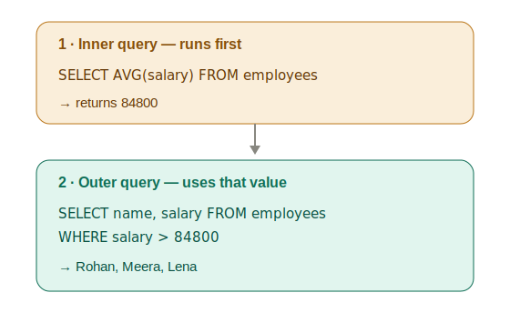

# Subqueries (a query inside a query)

**Topic:** _Nested queries_ · **Date:** _2026-07-09_ · **Difficulty:** ⭐⭐⭐

---

## What it is

A subquery is a **`SELECT` wrapped inside another query.** The inner query runs _first_, produces a result, and the outer query uses it. Query inside a query.

For instances: **"I need an answer before I can ask my real question."** What's the average? → then who's above it. What's the max? → then who earns it.

## Why / when to use it

When your real question depends on a value you have to compute first. Classic example — "who earns more than the average?" You can't do it flat:

```sql
SELECT name FROM employees
WHERE salary > AVG(salary);   -- ERROR: WHERE runs before aggregates (execution order!)
```

So you compute the average in a subquery first, then compare against it.

## How it runs — inside-out



The inner query in parentheses runs first, hands its answer up, and the outer query uses it.

## The types

- **Scalar subquery — returns ONE value.** Use with `=`, `>`, `<`.

```sql
SELECT name, salary FROM employees
WHERE salary > (SELECT AVG(salary) FROM employees);
```

- **List subquery — returns MANY values.** Use with `IN` (or `NOT IN`).

```sql
SELECT name FROM employees
WHERE dept_id IN (SELECT dept_id FROM departments WHERE city = 'Bangalore');
```

- **Nested subquery — a subquery inside a subquery.** E.g. second-highest salary = "the max salary that is less than the overall max":

```sql
SELECT name, salary FROM employees
WHERE salary = (SELECT MAX(salary) FROM employees
                WHERE salary < (SELECT MAX(salary) FROM employees));
```

## In my own words

> _A subquery is just a query inside a query. We use one when our answer depends on another result we've gotta figure out first. The inner query runs first and passes its result to the outer one. For tricky problems these can go a few levels deep, but too much nesting gets messy. There's a cleaner way called a **CTE** that we'll learn later._

## Gotchas / things that tripped me up

- **`=` with a multi-row subquery is an ERROR, not "pick the first row."** If the inner query returns multiple values (e.g. dept_ids 2 and 3), `=` fails with "more than one row returned." Multiple rows → use `IN`.
- **The golden rule still applies inside subqueries:** no naked column beside an aggregate. `SELECT name, MAX(salary) ...` returns a _random_ name next to the max — put the logic in `WHERE` instead.
- **"Ran and looked right" ≠ correct.** A query can run, show a plausible result on small data, and still be wrong (random-name pairing, or ties silently hidden). It may even error on a strict database. Trust the _structure_, not the output.
- **Ties get hidden by the broken version.** If two people share the second-highest salary, the naked-column version shows only one; the `WHERE salary = (...)` version correctly shows both.
- **`NOT IN` misbehaves if the inner list contains a NULL** — it can return nothing. Watch for it later.

---

## Practice

_Solve each one yourself on the `employees` + `departments` tables._

1. Show the `name` and `salary` of everyone earning more than the average salary.
2. Show the `name` of whoever earns the maximum salary.
3. Show the `name` of every employee whose department is in Bangalore, using a subquery with `IN`.
4. Show the `name` and `salary` of everyone earning below the average salary, cheapest first.
5. Show employees whose `dept_id` is NOT in the list of departments located in Bangalore.
6. Show the average salary of employees who earn above the overall average.
7. Show the `name` and `salary` of the employee earning the second-highest salary, using a nested subquery (not OFFSET).
8. Why does `WHERE dept_id = (SELECT dept_id FROM departments WHERE city = 'Bangalore')` fail, and how do you fix it?
