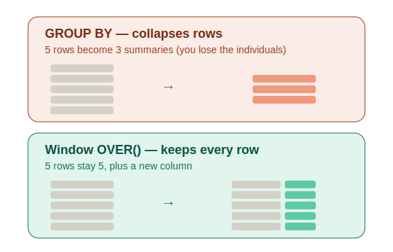

# Window Functions (OVER, PARTITION BY, ranking)

**Topic:** _Calculating alongside rows_ · **Date:** _2026-07-10_ · **Difficulty:** ⭐⭐⭐

---

## What it is

A window function does a calculation across a set of rows **but keeps every row visible.** That's the whole trick, and it's easiest to get by comparing it to `GROUP BY`:

- `GROUP BY` **collapses** many rows into one summary. You get `Hyderabad | 86000`, but you lose the individual people.
- A window function does the same maths, but **keeps all the rows** and adds the summary as a _new column_ beside each one.



## Why / when to use it

Whenever you want to show **each row AND some summary or rank next to it** — "show every employee _and_ the department average," "rank everyone by salary but keep all their details." `GROUP BY` can't do that (it collapses); window functions can.

## `OVER()` — the keyword that makes it a window function

Add `OVER()` to an aggregate and it stops collapsing:

```sql
SELECT name, salary, AVG(salary) OVER () AS avg_all
FROM employees;
```

Every employee's row survives, with the overall average (84800) sitting beside each. No `OVER()`, and it's just a plain aggregate that collapses.

## `PARTITION BY` — a GROUP BY that keeps your rows

`PARTITION BY` splits rows into groups and runs the calc per group — but keeps every row:

```sql
SELECT name, dept_id, salary,
       AVG(salary) OVER (PARTITION BY dept_id) AS dept_avg
FROM employees;
```

Each employee shows _their own department's_ average, and nobody is collapsed away. Think of it as GROUP BY's row-keeping cousin.

## The ranking functions

These number your rows in an order (`ORDER BY` goes _inside_ the `OVER()`). They only differ in how they handle **ties**. Example with salaries `100, 90, 90, 80`:

| salary | ROW_NUMBER | RANK | DENSE_RANK |
| ------ | ---------- | ---- | ---------- |
| 100    | 1          | 1    | 1          |
| 90     | 2          | 2    | 2          |
| 90     | 3          | 2    | 2          |
| 80     | 4          | 4    | 3          |

- **ROW_NUMBER** — always unique (1,2,3,4). Ignores ties. Like a headcount.
- **RANK** — ties share a number, then **skips** (1,2,2,**4**). Like a race podium (two 2nds → no 3rd).
- **DENSE_RANK** — ties share a number, **no skip** (1,2,2,**3**). Tight tiers, no gaps.

```sql
SELECT name, salary,
       RANK()       OVER (ORDER BY salary DESC) AS rnk,
       DENSE_RANK() OVER (ORDER BY salary DESC) AS dense_rnk,
       ROW_NUMBER() OVER (ORDER BY salary DESC) AS row_num
FROM employees;
```

## The capstone pattern — rank inside, filter outside

You **can't** filter a window function in `WHERE` — window functions run _after_ WHERE (execution order), so the rank column doesn't exist yet. The fix: compute the rank in a **subquery**, then filter on the outside.

```sql
-- Top earner in each department:
SELECT * FROM (
    SELECT name, dept_id, salary,
           ROW_NUMBER() OVER (PARTITION BY dept_id ORDER BY salary DESC) AS rn
    FROM employees
) AS ranked
WHERE rn = 1;
```

The inner query ranks (so `rn` exists), the outer query filters `WHERE rn = 1`. This ties window functions (note 07) back to subqueries (note 06) and execution order (note 01) — the whole course in one query.

## In my own words

> _A window function does a calculation but keeps every row, instead of collapsing them like GROUP BY. OVER() is what turns it on._

## Gotchas / things that tripped me up

- **`OVER()` is what makes it a window function.** Without it, it's a plain aggregate that collapses your rows.
- **You can't filter a window function in `WHERE`** — it's computed too late (after WHERE). To filter on a rank, wrap the query in a subquery and filter outside.
- **LIMIT/OFFSET can't do "per group."** LIMIT works on the whole result; only `PARTITION BY` + a ranking function can do "top N _per department_."
- **Pick the right ranking function:** `DENSE_RANK` for "true Nth highest" (tie-safe), `ROW_NUMBER` for "exactly one row per group" (guaranteed unique), `RANK` when you actually want the skip (like sports standings).
- **`rank` is a reserved word** — don't name a subquery `AS rank`; use `AS ranked` or `AS r`.

---

## Practice

_Solve each one yourself on the `employees` table._

1. Show every employee's `name`, `salary`, and the overall average salary next to each row.
2. Show every employee's `name`, `dept_id`, `salary`, and their department's average salary next to each row.
3. Rank all employees by salary highest-first using ROW_NUMBER.
4. Show `name`, `salary`, and DENSE_RANK by salary (highest first).
5. Show each employee's `name`, `dept_id`, `salary`, and their rank _within their own department_ by salary.
6. Show the top earner in each department (one row per department, no duplicates).
7. Find the employee(s) with the second-highest salary overall, the tie-safe way.
8. Why does the below query fails? how do you fix it?

```sql
SELECT name, salary,
       RANK() OVER (ORDER BY salary DESC) AS rnk
FROM employees
WHERE rnk = 1;
```
